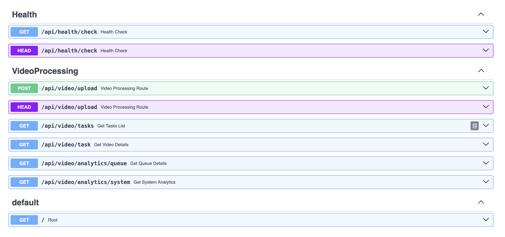

# VideoProcessing

## Requirements
- Python 3.8+

## Installation and Application Setup

1. Clone the repository
```bash git clone <repository-url>```

2. Create a virtual environment and activate it
```bash python3 -m venv venv source venv/bin/activate```

3. Install dependencies
```bash pip install -r requirements.txt```

4. Configure your environment variables
   Copy the example environment file and update it with the requirement values:
   ```bash cp .env.example .env```

## Running the application
```bash uvicorn main:app --reload```

## For Local Testing
1. Install ffmpeg4 on your local machine : macOs ```brew install ffmpeg```, Windows : ```choco install ffmpeg```
2. Start Redis Container in a different terminal ```docker run -p 6379:6379 redis```
3. Start Celery task Queue in a different terminal ```celery -A app.core.worker.celery worker --loglevel=info```
4. Start Flower container for Celery Monitoring in a different terminal ```celery -A app.core.worker.celery flower --port=5555```, Go To : ```http://localhost:5555```
Replace BROKER_URL=`redis://localhost:6379/0` and BACKEND_URL=`redis://localhost:6379/0` in .env


The application will start at `http://127.0.0.1:8000`
- Health check: `http://localhost:8000/api/health/check`
- Check Application is running or not: `http://localhost:8000/`
- Docs: ```http://localhost:8000/docs```

## Project Structure
```
├── app/
│   ├── api/                          # API endpoints for external interaction
│   │   ├── health.py                 # Health check endpoint
│   │   └── video_processing.py       # Endpoints related to video processing (upload, status, etc.)
│   │
│   ├── constants/                    # Application-level constants
│   │   └── video_constants.py        # Status constants (Saved, Processing, Processed, Failed)
│   │
│   ├── core/                         # Core business logic and environment configuration
│   │   ├── celery_core.py            # Celery Processing (Processing Video Inside Celery tasks)
│   │   ├── config.py                 # Application startup configuration (e.g., environment variables)
│   │   ├── video_processing_service.py # Pre- and post-processing logic for videos
│   │   └── worker.py                 # Celery task worker that handles background jobs (Celery configuration and setup)
│   │
│   ├── dtos/                         # DTOs (Data Transfer Objects) for request/response
│   │   ├── collection_names.py       # MongoDB collection names (application-level constants)
│   │   ├── error_success_code.py     # Custom application-level success and error codes
│   │   └── video_processing_dtos.py  # Request/Response models related to video processing
│   │
│   ├── utils/                        # Utility modules
│   │   ├── db_connect.py             # DB connection logic used during app start (sync and async connection)
│   │   ├── db_query.py               # Common MongoDB query abstractions
│   │   ├── file_processing_utils.py  # File handling logic (validation, conversions)
│   │   ├── logger.py                 # Application-wide logging setup
│   │   ├── request_validations.py    # Request validation utils (file types, rate limits)
│   │   └── s3_utils.py               # Object storage interactions (upload/download to S3)
│
├── logs/
│   └── app.log                       # Application log output
│
├── venv/                             # Virtual environment (excluded from VCS)
│
├── .env                              # Environment variables (local deployment)
├── .env.example                      # Example environment file
├── .gitignore                        # Git ignored files
├── docker-compose.yml                # Docker Compose configuration
├── Dockerfile                        # Docker image build configuration
├── main.py                           # Entry point to start the FastAPI app
├── README.md                         # Project overview and documentation
└── requirements.txt                  # Python dependencies
```

Key Notes
1. DTOs: Centralized under dtos/ to ensure consistency of request/response schema and avoid duplicating validation logic.
2. Environment Separation: config.py under core/ loads and manages all environment-specific variables on application start. (Preventing fetch repeatedly from env file (Operational Overhead prevention))
3. DB Access: Utilities for database interaction are split into:
  db_connect.py (used in main app – synchronous)
  db_connect via Celery tasks (handled differently due to async-sync incompatibilities)
4. Celery Tasks: worker.py sets up the Celery worker and broker configuration, while celery_core.py runs background processing tasks. (Async Context maintained vai asyncio)

🔧 Suggested Improvements
1. Unit Tests Directory: Add a tests/ directory to manage automated tests (pytest, unittest, etc.).
```
app/
tests/
  ├── api/
  ├── core/
  ├── utils/
  └── conftest.py
```
2. Schemas Folder (optional): If DTOs become complex or large in number, consider separating request/response models into a schemas/ or models/ sub-package under app/.

## Tasks Completed
1. Upload Video (With proper rate limiting , size, content type validations)
2. Fetch user level tasks list (Can be optimized further, implementing paginations in API)
3. Fetch Individual Task (using task_id)
4. Fetch Individual Task Status (using task_id)
5. Fetch Individual Task Thumbnail (using task_id)
6. Fetch System Metrics
7. Fetch Queue level metrics (Used Flower Dashboards)
8. Configurable Rate Limiting
9. Thumbnail Generation

## Tasks Skipped (Due to time constraints)
1. Authentication and Authorizations (Can be easily done via the http middleware in main.py)
2. User Login
3. Change Passwords
4. Configurable Video Processing inputs from users (Can be easily done via the upload API, using mongo for making this extensible in terms of the input from users)
5. Logout Functionalities

## Architecture


## Architecture Components
1. ```FastAPI```
    Purpose: Python web framework used for building APIs.
    Why FastAPI:
      Natively supports asynchronous programming (async / await)
      High performance (based on Starlette and Pydantic)
      Automatically generates interactive API docs (Swagger/OpenAPI)
    Note: Runs in a single-threaded event loop — async operations must be used for I/O-bound tasks to maximize throughput.
2.  ```Uvicorn```
    Purpose: ASGI server used to serve the FastAPI app.
    Why Uvicorn:
      Ideal for asynchronous web frameworks.
      Fast, lightweight, and production-ready.
      Alternatives:
        Gunicorn (WSGI): For sync frameworks (e.g., Flask, Django).
        Uvicorn + Gunicorn: Common combo for production — Gunicorn manages multiple Uvicorn worker processes for scalability.
3. ```MongoDB```
    Purpose: Primary database for application data.
    Why MongoDB:
      Document-oriented — ideal for flexible data like video metadata, S3 URLs, processing states.
      Schema-less structure aligns with dynamic and evolving data formats.
    Note: User data (credentials, billing, etc.) could be stored in an RDBMS (e.g., PostgreSQL).
    If both are needed, options include:
      One service handling both MongoDB + SQL (increased complexity)
      Microservices architecture to isolate concerns and data layers.
4. ```Redis (as Message Broker)```
    Purpose: Broker between FastAPI and Celery for task distribution.
    Why Redis:
      In-memory store → very low latency.
      Lightweight and easy to deploy.
    Alternatives:
      RabbitMQ: Durable messaging with delivery guarantees; higher setup complexity.
      Kafka: Ideal for large-scale, distributed event streaming systems; higher throughput and durability.
      Decision Basis: Redis chosen for speed and simplicity in async task queuing.
5. ```Celery```
    Purpose: Asynchronous task queue for handling background jobs.
    Use Cases:
      Video processing
      Metadata generation
      Thumbnail creation
    Integration:
      Works with Redis (or RabbitMQ) as the broker
      Worker tasks are defined and run via worker.py
6. ```Amazon S3 (Object Storage)```
    Purpose: Store all large unstructured data such as:
    Uploaded video files
    Generated thumbnails
    Processed video outputs
    Why S3:
      Scalable, durable (99.999999999%), and cost-effective
      Supports direct upload/download and pre-signed URLs for secure access

# Implementation Decisions
1. Created an Application Level Middleware for centralized authentication and authorization
2. Created a global MongoConnection on application start (One Connection per application - Prevent connection exhaustion for DB)
3. Loading .env once on application start
4. Validation with video file in memory on video uploads - Prevents unnecessary video uploads in S3, Prevents thundering herd per user
5. Using asyncio in celery worker - Celery is Synchronous by nature and does not support FastAPIs async-await. Using asyncio.get_event_loop() and asyncio.new_event_loop(), preventing asyncio to close event loops on a single operation. (Without this, only one request will be processed, the next request will get an error - ```Event Loop Closed```)
6. Custom Success and Error codes at the application level for proper error messaging to user.
7. Saving status (Saved, Processing, Processed, Failed), for each task in mongoDb.
8. Created an API for fetching task status, Can be extended to use sockets.

# Swagger Docs

